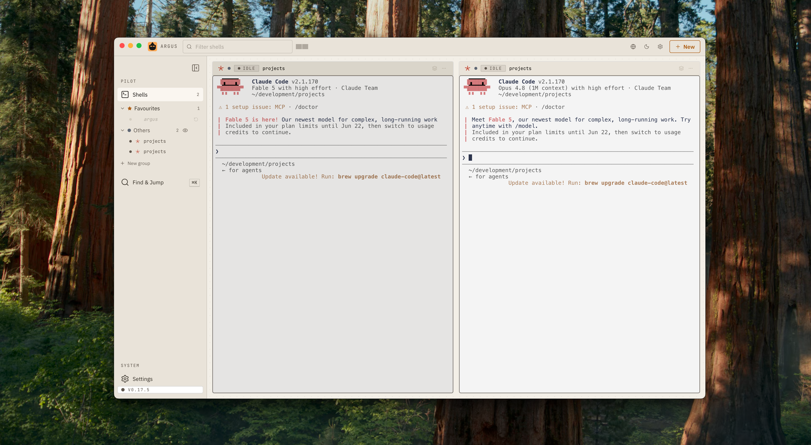

# Argus

   

A native macOS desktop app for managing multiple AI coding agent sessions at once. Spawn [Claude Code](https://claude.ai/code), [Gemini CLI](https://github.com/google-gemini/gemini-cli), or [OpenAI Codex](https://github.com/openai/codex) processes in real pseudo-terminals, watch their output side by side, and track each session's state — running, waiting, idle, or exited — in real time.



## Table of Contents

- [Installation](#installation)
- [Features](#features)
  - [Session Management](#session-management)
  - [Layout & Organization](#layout--organization)
  - [Focus Mode](#focus-mode)
  - [Terminal](#terminal)
  - [File Explorer](#file-explorer)
  - [Git Diff Viewer](#git-diff-viewer)
  - [Git Commit & Staging](#git-commit--staging)
  - [Multi-Agent Support](#multi-agent-support)
  - [Remote Access](#remote-access)
  - [Password Authentication](#password-authentication)
  - [Auto-Update](#auto-update)
  - [Notifications](#notifications)
  - [Mobile Support](#mobile-support)
  - [Theme](#theme)
- [Keyboard Shortcuts](#keyboard-shortcuts)
- [How It Works](#how-it-works)
- [Tech Stack](#tech-stack)

## Installation

Install via [Homebrew](https://brew.sh):

```bash
brew tap antonioromano/argus https://github.com/antonioromano/argus
brew install --cask argus
```

That's it — launch Argus from Spotlight or your Applications folder.

> The app is ad-hoc signed (no Apple Developer certificate). The cask automatically strips the macOS quarantine flag on install, so the app opens normally — no right-click → Open dance required.

Update to the newest release the same way you update any cask:

```bash
brew upgrade --cask argus
```

## Features

### Session Management

- **Create sessions** — Pick a project folder (system picker or interactive folder tree), set an optional name, and choose which AI agent to run
- **Clone sessions** — Duplicate an existing session in the same folder with a different agent or different CLI flags
- **Delete sessions** — Close sessions with a confirmation prompt
- **Status badges** — Each session shows its real-time state: `waiting` (prompt visible), `running` (agent processing), `idle` (quiet, no prompt), or `exited`
- **Collapsible sessions** — Minimize any session to a chip strip at the top of the dashboard; collapsed sessions stay connected and continue showing live status, then restore with one click
- **Agent CLI flags** — Configure per-agent command-line flags (e.g. `--model`, `--verbose`) in Settings with sticky defaults; toggle individual flags on or off per session at creation time
- **Git dirty indicator** — Orange warning icon next to session names when uncommitted changes exist; visible in terminal cards, focus mode, sidebar, collapsed chips, and dropdowns

### Layout & Organization

- **Grouped grid** — Sessions are automatically grouped by their working folder
- **Drag-and-drop reordering** — Rearrange both groups and individual sessions within groups via drag handles
- **Persistent order** — Session ordering is saved to disk and restored on relaunch

### Focus Mode

- **Full-screen session** — Click into any session to expand it, with the terminal taking up most of the view
- **Collapsed session strip** — Other sessions appear as a horizontal mini bar with status indicators for quick switching
- **Explorer panel** — Toggle a file explorer alongside the terminal in focus mode; mutually exclusive with the diff panel
- **Exit** — Press **Escape** or click the back button to return to the grid

### Terminal

- **xterm.js terminal** — Smooth, high-performance terminal with the DOM renderer for crisp text on a cold start
- **Live two-way I/O** — All keyboard input and terminal output streams in real time
- **Reconnect replay** — A 100KB rolling buffer per session replays output when you reconnect or reload
- **Full terminal features** — Clickable links, copy-paste, and responsive resizing

### File Explorer

- **Browse project files** — Tree-based file browser scoped to each session's working directory, with a session sidebar for switching between projects
- **Syntax highlighting** — 29 languages supported via Prism (TypeScript, JavaScript, Python, Rust, Go, Java, C/C++, C#, Ruby, PHP, Swift, Kotlin, SQL, GraphQL, YAML, TOML, Dockerfile, Makefile, and more)
- **File search** — Search by filename or file content with debounced real-time results
- **Inline editing** — Edit files directly in the app; conflict detection compares `mtime` to prevent overwriting changes made by the agent after you opened the file
- **Markdown preview** — Markdown files render with full formatting
- **Copy to clipboard** — One-click copy of the full file contents
- **Resizable panels** — Drag dividers between sidebar, file tree, and preview columns; sizes persist
- **Ephemeral terminal** — Open a real shell in the session's working directory from the Explorer view without creating a new session
- **State persistence** — Selected session, file, and search query persist across tab switches

### Git Diff Viewer

- **Inline diff panel** — Opens alongside the terminal in focus mode, showing the current git state of the session's folder
- **Three diff sections** — Unstaged changes, staged changes, and branch changes displayed separately
- **Auto-refresh** — Polls for new changes every 3 seconds while the session is running; manual refresh button also available
- **File-level breakdown** — Expandable file sections with per-file addition/deletion counts; `NEW` and `DELETED` badges for created or removed files
- **Diff fullscreen** — Expand the diff panel to full screen; press **Escape** to collapse

### Git Commit & Staging

- **Commit mode** — Toggle commit mode in the diff panel to enter a staging workflow alongside the live diff
- **Selective staging** — Stage changes at the file, hunk, or individual line level using tri-state checkboxes (none / partial / all selected)
- **Commit bar** — Write a commit message, toggle amend mode (pre-fills the last commit message), and commit with one click or **Ctrl/Cmd+Enter**
- **Discard with undo** — Discard selected changes with a 30-second in-memory undo window; applies at the hunk or line level
- **Stale diff detection** — If the diff refreshes while commit mode is active, a warning banner notifies you before you stage outdated selections

### Multi-Agent Support

- **Built-in agents** — Claude Code, Gemini CLI, and OpenAI Codex available out of the box
- **Custom agents** — Add any CLI tool as an agent via Settings (name + command)
- **Default agent** — Configure which agent is pre-selected when creating new sessions
- **Install detection** — Settings panel shows which agents are installed and their resolved paths, with install commands for missing ones

### Remote Access

- **ngrok tunnel** — Expose the dashboard publicly via an ngrok tunnel directly from the toolbar
- **One-click start/stop** — Start and stop the tunnel from the header; copy or open the public URL
- **Sleep prevention** — Keeps the computer awake while the tunnel is active (`caffeinate`)
- **Install guidance** — If ngrok is not installed, shows install instructions

> **Security note:** The public URL grants full terminal access to all sessions. Share it only with trusted users.

### Password Authentication

- **Auto-enabled with ngrok** — When a tunnel is started, you set a password; the URL and password are shown together for easy sharing
- **Secure comparison** — Passwords are hashed with SHA-256 and compared using `crypto.timingSafeEqual` to prevent timing attacks
- **Token-based sessions** — After login, a UUID token is issued and validated on all subsequent API and Socket.io requests; tokens are cleared when the tunnel stops

### Auto-Update

- **Hourly version check** — Compares the installed version against the remote GitHub repository
- **One-click update** — When a new version is available, a modal shows the version diff and changelog
- **Safety guard** — Refuses to update if the working tree has uncommitted local changes

### Notifications

- **Desktop notifications** — Fire when a session transitions to `waiting` while the app is not in focus; click to focus the app. The packaged (ad-hoc signed) build delivers via a bundled [terminal-notifier](https://github.com/julienXX/terminal-notifier): macOS asks once to allow notifications from "terminal-notifier" — accept it, and make sure that entry stays enabled in System Settings → Notifications
- **Tab title badge** — App title shows `(N) Argus` with the count of sessions awaiting input
- **Waiting count badge** — Orange badge on the Sessions navigation tab shows how many sessions need attention
- **Configurable** — Toggle on/off in Settings
- **Auto-dismiss** — Notifications close automatically when the session leaves `waiting` status or is deleted

### Mobile Support

A mobile companion view is reachable from your phone's browser when an ngrok tunnel is active.

- **Bottom navigation** — On narrow screens, a bottom nav bar provides access to Sessions, Git Diff, and Explorer tabs, plus a floating action button for new sessions
- **Quick-action buttons** — Pre-mapped touch buttons for common terminal inputs: arrow keys, Enter, y/n, Ctrl+C, Escape, Tab, and number options 1-5
- **Mobile text input** — A text input row for typing arbitrary commands and sending them to the terminal
- **Touch scrolling with momentum** — Custom touch event handling with inertia-based momentum scrolling in terminals
- **Swipe gestures** — Swipe down on the diff file sheet to dismiss it
- **Safe area support** — Respects iOS safe-area-inset for the bottom nav and header

### Theme

- **Dark and Light modes** — Dark theme uses a Tokyo Night-inspired palette; Light theme for bright environments
- **Persisted preference** — Theme choice is saved and defaults to the OS system preference

## Keyboard Shortcuts

| Key | Action |
|-----|--------|
| `Escape` | Exit diff fullscreen → close diff panel → exit explorer fullscreen → close explorer panel → exit focus mode (priority order) |
| `Ctrl/Cmd+Enter` | Submit commit message (when commit bar is focused) |

## How It Works

1. **Session creation** — Create named sessions pointed at any local directory.
2. **PTY spawning** — Argus spawns the AI CLI inside a pseudo-terminal via your login shell (`$SHELL -l -c "exec <agent>"`).
3. **Real-time streaming** — Terminal I/O flows through Socket.io rooms. Each session is a room identified by its UUID.
4. **State detection** — Output is stripped of ANSI codes and, after a 500ms settle period, the tail is analyzed to classify the session as `waiting`, `running`, `idle`, or `exited`.
5. **Reconnect replay** — A 100KB rolling buffer per session lets the UI catch up on output when reopening or reconnecting.
6. **Session survival** — Sessions run under a dedicated tmux server, so they survive quitting and reopening the app.

## Tech Stack

| Layer | Technologies |
|-------|-------------|
| **Shell** | Electron (native macOS app) |
| **Server** | Express, Socket.io, node-pty, TypeScript (ESM, strict) |
| **Client** | React 19, xterm.js (DOM renderer), Socket.io-client, @dnd-kit, Vite |
| **Shared** | TypeScript strict types for session models, REST shapes, Socket.io event maps |
| **Styling** | CSS custom properties (design tokens) — no CSS framework |
| **Syntax highlighting** | react-syntax-highlighter (Prism, 29 languages) |
| **Icons** | lucide-react |
| **Session survival** | Bundled tmux (dedicated `argus` socket) |

---

Built for developers who run multiple AI coding agents at once.
